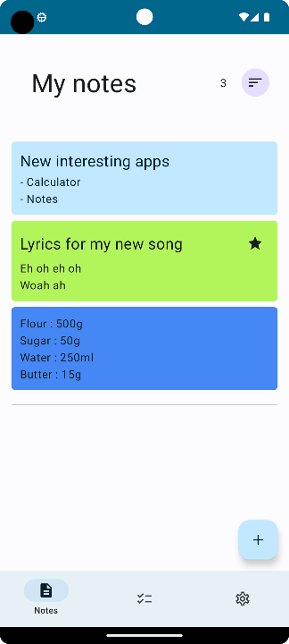
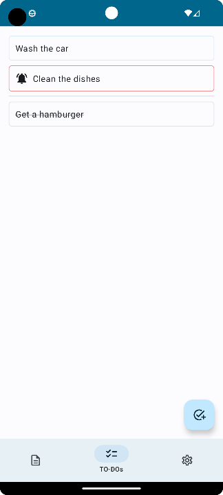
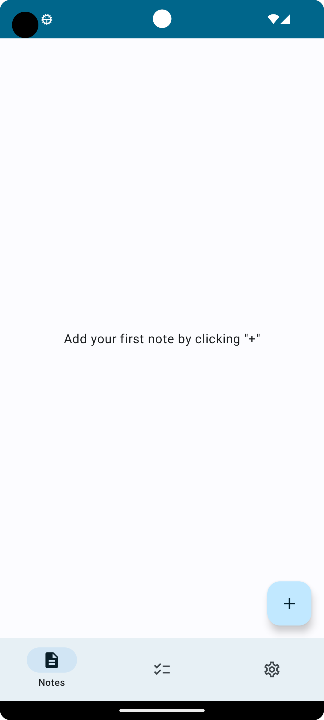
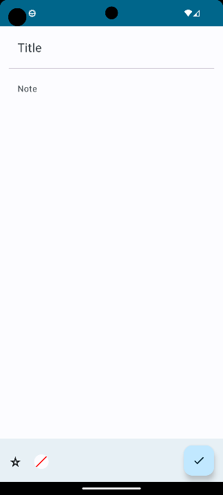
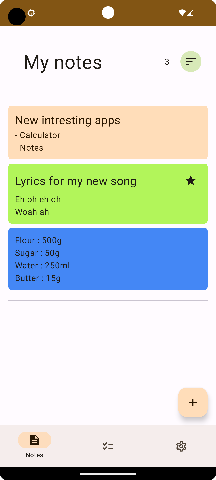
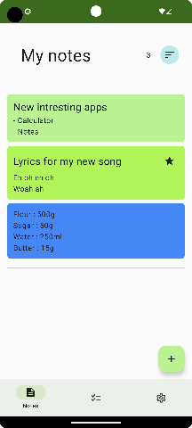
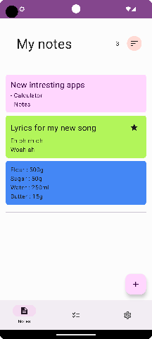

# Notes app - written Jetpack Compose

This is a simple app where you can add and edit notes and TODO tasks

### Libraries and concepts used

- Room database
- Jetpack Compose
- [Material 3](https://m3.material.io/)
- [Dagger Hilt](https://github.com/google/dagger/tree/master/java/dagger/hilt)

### Overview

Notes app allows you to store notes, and To-Do tasks, in a modern, simple user interface.

&#32;&#32;

### Functionalities

#### Notes

Create a new note by clicking the floating action button "plus"

A note can have a title (not required) a note body, a color, and being selected as favorite or no.
Do not forget to click "Check" else your note will be discard.

### Material You support

Notes app is using Material 3 so it is fully compatible with [Material You](https://material.io/blog/announcing-material-you) design.

&#32;&#32;